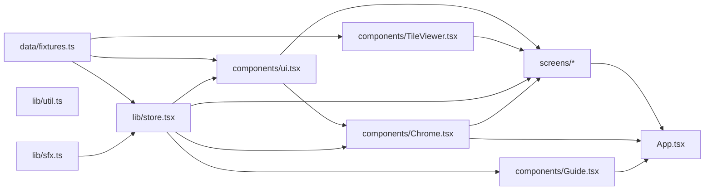
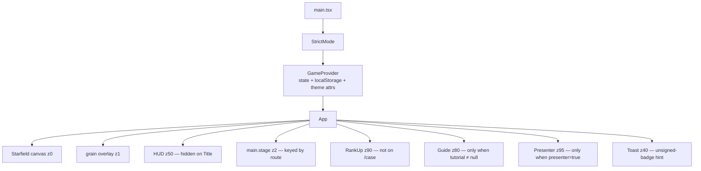
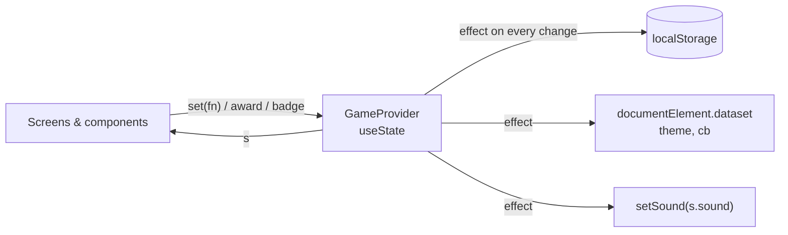
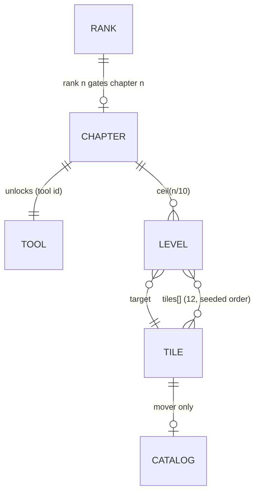
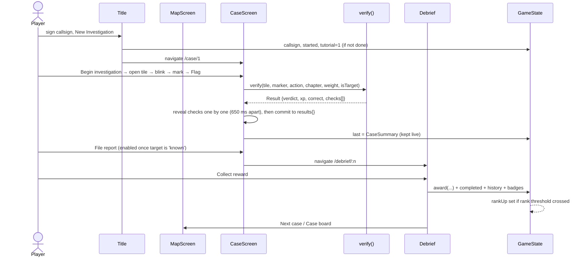
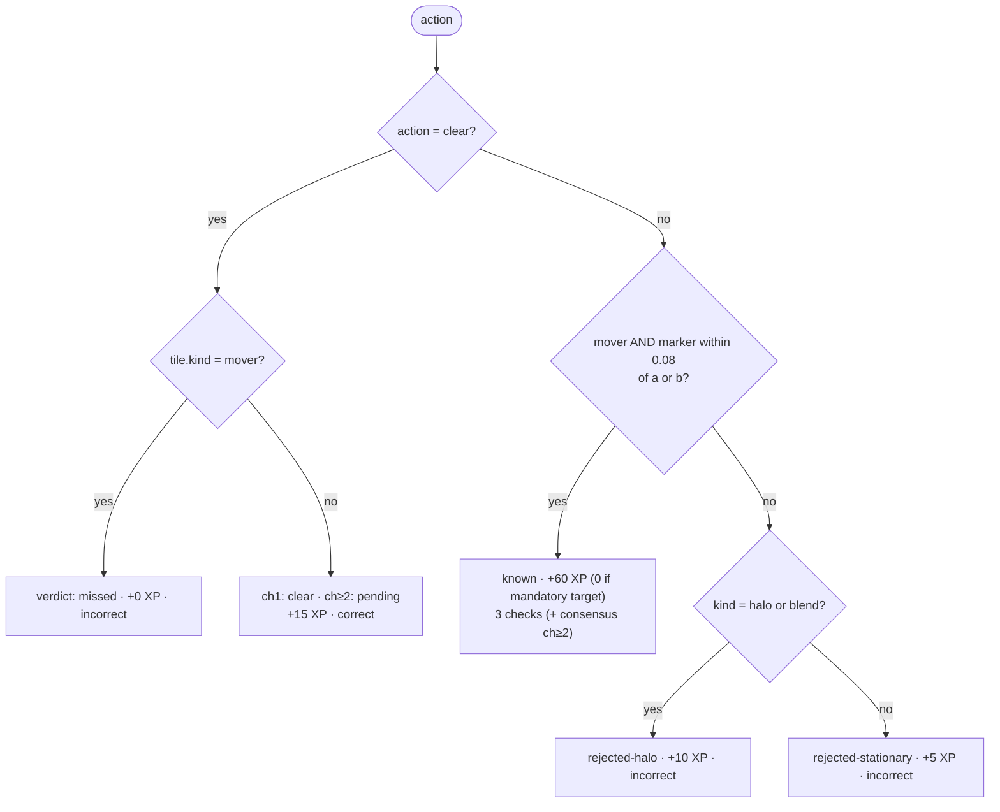
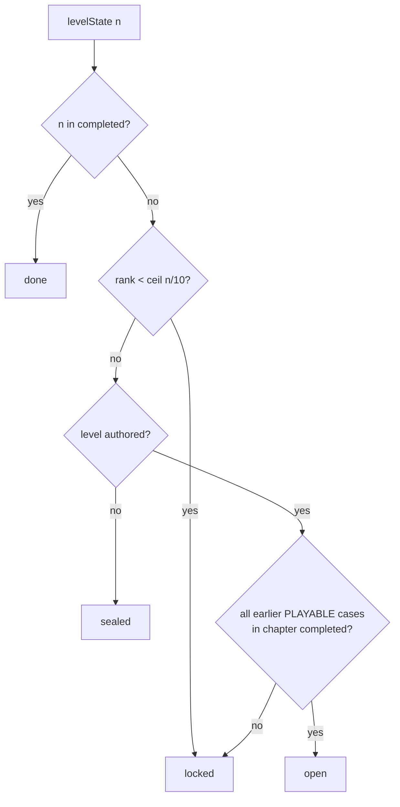

# Cosmic Detective — Architecture

> Status: describes the **demo / presentation build** as implemented in `src/`.
> Derived from a read of every file under `src/` (see "Scope of this document").
> Companion document: [`contracts.md`](./contracts.md) — the precise shapes, rules and seams.

## 1. What the app is

Cosmic Detective is a single-page, client-only citizen-science game. The player
inspects **real archival sky plates** (POSS-I vs POSS-II, from NASA SkyView / DSS),
blinks between two epochs to find a source that moved, flags it, and watches the
flag pass through a staged **verification pipeline** before any reward is given.
Progress is expressed as XP, cumulative tiles reviewed, and a five-step **rank**
ladder that unlocks tools and chapters.

Design pillars encoded in the code (and surfaced on the Archive screen):

| Pillar | Where it shows up in code |
|---|---|
| Real data first | `TILE_IMG`, `/public/sky/*.jpg`, `Tile.ra/dec/size` are real coordinates |
| Evidence before reward | `verify()` in `CaseScreen.tsx`; XP is only granted via a `Result` |
| Accessible to everyone | `data-theme`, `data-cb` (Okabe–Ito), icon-per-verdict in `Chip` |
| Mastery through progression | `RANKS`, `TOOLS`, `levelState()` gate tools and chapters |
| No false discoveries | Verdict vocabulary has `known` / `candidate`, never "confirmed" |

## 2. Scope of this document

Reviewed in full: everything under `src/` (`main.tsx`, `App.tsx`, `styles.css`,
`components/`, `data/fixtures.ts`, `lib/*`, all eight `screens/`), plus `index.html`,
`vite.config.ts`, `netlify.toml`, `scripts/fetch-sky.mjs`, `README.md` and `PLAN.md`.

**Not reviewed** (not provided): `AGENTS.md`, `package.json`, `tsconfig.json`, and the
binary assets in `public/`. Dependency versions other than those stated in the README
(Vite, React 19) are therefore unknown. `PLAN.md` refers to a design document
("Section 5.4" on weighted agreement) that was also not provided.

## 3. Technology & dependencies

- **Vite + `@vitejs/plugin-react`** (`vite.config.ts` is just `defineConfig({ plugins: [react()] })`; no aliases, no proxy, no env handling).
- **React 19** (per README; code uses `createRoot`, `StrictMode`) with TypeScript, function components and hooks only.
- **No router library, no state library, no UI kit.** Routing is hash-based (`useRoute`);
  state is one React context holding a single object (`GameProvider`).
- **No runtime API calls in the app code.** All content is static: fixtures in
  `data/fixtures.ts`, images in `/public`. The only third-party runtime request is
  **Google Fonts** (Big Shoulders Display, Chakra Petch, JetBrains Mono, loaded from
  `index.html`); offline, the CSS falls back to `system-ui` / monospace.
- **Netlify hosting.** `netlify.toml`: `npm run build`, publish `dist`, and a catch-all
  `/* → /index.html (200)` rewrite. The rewrite is not needed for the hash router itself,
  but keeps deep links to static files and refreshes safe.
- **Netlify Image CDN** for resizing (`cdn()` in `lib/util.ts` rewrites every image URL
  to `/.netlify/images?url=…&w=…&fm=webp`). `vite.config.ts` has no proxy or plugin for
  this path, so under plain `npm run dev` those requests will not be resolved by Vite
  (and the SPA fallback may answer them with HTML). Use Netlify's local dev tooling to
  see images, or add a dev-only passthrough in `cdn()`.
- Art (chapter backgrounds, guide portrait, title key art) was generated with Gemini via
  Netlify AI Gateway (README); the files are committed under `public/img/`.
- **Web Audio API** for all sound (`lib/sfx.ts`), no audio files.
- **Canvas 2D** for the starfield, **inline SVG** for emblems, icons, vectors and map lines.
- **Plain CSS** (`styles.css`, ~640 lines) with custom properties; no CSS-in-JS, no Tailwind.

## 4. Repository layout

```
src/
  main.tsx            Entry: StrictMode → GameProvider → App
  App.tsx             Route switch + persistent chrome (starfield, HUD, overlays)
  styles.css          Tokens, themes, layout, animation, responsive rules
  components/
    Chrome.tsx        Logo, HUD (top bar), RankUp overlay, Presenter panel
    Guide.tsx         Tutorial engine (spotlight + Dr. Varga) and TUTORIAL step table
    TileViewer.tsx    Plate viewer: A/B/blink/diff, marker, loupe, coordinates
    ui.tsx            Starfield, RankEmblem, XPBar, Chip, Btn, DisplayToggles
  data/
    fixtures.ts       All content: tiles, ranks, tools, chapters, levels, badges, players
  lib/
    store.tsx         GameState, GameProvider, useGame, useRoute, FRESH, DEMO_SAVE
    sfx.ts            Synth sound effects + setSound
    util.ts           cdn(), raStr/decStr, fmt, navigate
  screens/
    Title.tsx  MapScreen.tsx  CaseScreen.tsx  Debrief.tsx
    Rankings.tsx  Dossier.tsx  Archive.tsx  Settings.tsx
public/
  img/   ch1–ch5.png (chapter art), guide.png, title-key.png
  sky/   {tileId}-a.jpg / {tileId}-b.jpg plus 6 Barnard band images
scripts/fetch-sky.mjs   Pulls plates from NASA SkyView (not reviewed)
```

Dependency direction is strictly one-way:



Two soft cycles worth knowing about: `CaseScreen` and `Debrief` import `levelState`
from `MapScreen` (a screen exporting domain logic), and `Title` imports `Logo` from
`Chrome`. Neither is a runtime cycle, but `levelState` is domain logic living in a view
file (see §13).

## 5. Runtime composition



Key points:

- `<main key={route}>` remounts the whole screen on every route change, which replays
  the `stageIn` animation and resets all local screen state. `CaseScreen` is additionally
  keyed by `n`.
- Overlays (RankUp, Guide, Presenter, Toast) are siblings of `main`, so they survive
  within a route and are layered purely by `z-index`.
- `Starfield` density is lowered on the title screen (0.6 vs 1).

## 6. Routing

Hash routing, no library. `useRoute()` listens to `hashchange`, strips the `#`, and
scrolls to top. `App` splits the string: `const [, base, arg] = route.split('/')`.

| Hash | Component | Notes |
|---|---|---|
| `#/` or empty | `Title` | `isTitle = !base`; HUD hidden |
| `#/map` | `MapScreen` | Case board |
| `#/case/:n` | `CaseScreen n` | `n = Number(arg)`; NaN yields the "Case file sealed" empty state |
| `#/debrief/:n` | `Debrief n` | Reads `state.last` |
| `#/ranks` | `Rankings` | |
| `#/dossier` | `Dossier` | |
| `#/archive` | `Archive` | "Mission" in the nav; works without signing in |
| `#/settings` | `Settings` | |
| anything else | `Title` | but `isTitle` is false, so the HUD still renders |

Navigation helper: `navigate(path)` assigns `window.location.hash`. HUD links use
`href="#/…"` directly; the active tab is `route.startsWith(href)`.

There are **no route guards**. Access control lives inside screens:
`CaseScreen` checks `levelState`, `Debrief` checks `s.last.level === n`.

## 7. State management

One object, `GameState`, in one context, persisted to `localStorage['cosmic-detective:v1']`.



- **Hydration:** `{ ...FRESH, ...JSON.parse(localStorage) }` — a shallow merge, so new
  top-level fields get defaults but nested shape changes are not migrated. The key is
  versioned (`:v1`) but there is no migration code.
- **Writes:** every change writes the entire state synchronously in an effect.
- **API surface:** `set(fn)` (generic updater), `award(patch)` (additive numeric
  increments with rank-up detection), `badge(id)` (idempotent add).
- **`award` is the only place rank-ups are detected.** It compares `rankFor(prev.tiles).n`
  with `rankFor(next.tiles).n`, sets `rankUp`, and grants the `field-analyst` badge.
- **Derived data is never stored.** Rank, next rank, XP-bar percent, accuracy, standing
  and "reviewed" counts are computed at render time from `tiles`, `correct`, `judged`, etc.
- **Transient vs persisted:** screen-local state (`CaseScreen`'s results, selection,
  marker, timer, running animation) is *not* persisted. Only the `last: CaseSummary`
  snapshot crosses from the case to the debrief via global state.

The context value is rebuilt on every state change (`useMemo` depends on `s`), so every
consumer re-renders on any change. Acceptable at this size.

## 8. Domain model and content

All content lives in `data/fixtures.ts`.



- **Tiles (12):** 5 `mover` (Barnard, Groombridge 1830, Lalande 21185, Wolf 359,
  van Maanen), 3 `stationary` fields, 1 `cluster` (M13), 1 `galaxy` (M51),
  1 `halo` (Vega), 1 `blend` (Albireo). `kind` is the ground truth the demo verifier uses.
  Movers carry `a`/`b` normalised pixel positions (÷512) and a `catalog` record.
- **Ranks (5):** thresholds on *cumulative tiles reviewed*, not XP:
  0 / 200 / 320 / 420 / 500, with consensus weights 1.0 / 1.4 / 2.1 / 2.9 / 4.0.
- **Tools (5):** blink (ch1), diff (ch2), bands (ch3), lightcurve (ch4), suite (ch5).
  Only blink and diff are implemented in the case screen; bands exist as a preview on
  the Dossier; lightcurve and suite are placeholders.
- **Chapters (5) × 10 cases = 50 case slots.** Only 5 cases are authored in `PLAYABLE`
  (cases 1–4 and 11). The rest have names in `LEVEL_NAMES` and render as `sealed`
  ("Tile pair in registration") or `locked`.
- **Level batches:** `order(target, seed)` builds a deterministic pseudo-random order of
  *all 12 tiles* with the target inserted at `(seed*5) % 12`. Every authored case therefore
  uses the same 12-tile pool in a different order.

## 9. Gameplay flow

### 9.1 End-to-end loop



### 9.2 Case screen internals

State machine inside `CaseScreen`:

- `phase`: `'briefing'` → `'scan'`. Briefing is a modal folder; "Begin investigation"
  switches phase (and advances tutorial 1→2).
- `results: Record<tileId, Result>` is the source of truth for the case.
- `running: {id, res, shown}` drives the staged reveal. `submit()` computes the result
  immediately but schedules `setTimeout`s to **reveal** each check and finally **commit**
  into `results`. Inputs are disabled while `running`.
- **One-shot vs retry:** non-target tiles are locked after their first result; the
  mandatory target may be resubmitted (see risk R3).
- `summary` is a `useMemo` over `results` and is mirrored into global `last` by an effect
  whenever at least one tile is reviewed.
- Keyboard: Space (blink toggle), 1/2 (epochs), D (diff, if unlocked), F (flag),
  C (clear), ←/→ (prev/next tile). Disabled while a tutorial step is active or an input
  is focused.
- Tool availability: `blink` always; `diff` only if `rank ≥ 2 && chapter ≥ 2`;
  `bands`/`lightcurve` always locked.

### 9.3 Verification pipeline (demo stand-in)

`verify()` is a pure function that mirrors the intended server-side pipeline and is the
**single seam** where a verification service will plug in.



Scoring in chapter 1 is "known answer key"; from chapter 2 a *Weighted consensus*
check is appended, but its numbers are fabricated (see R6).

### 9.4 Progression and rewards

- **Case XP** = Σ result XP + 50 (tutorial case) + 40 (clean-case bonus: target solved
  *and* every tile reviewed).
- **Collecting** happens only in `Debrief.collect()`. It calls `award` (XP, tiles, correct,
  judged, known, artifacts, clears), marks the case completed, prepends history (capped at 12),
  grants badges, and, in tutorial step 6, advances to step 7 and returns to the map.
- **Rank** derives from cumulative `tiles`. Crossing a threshold sets `rankUp`, shown by
  the `RankUp` overlay (suppressed while on `/case`).
- **Unlocking** is computed by `levelState(n, completed, tiles)`:



Because each case contributes at most 12 tiles and rank 2 needs 200, **organic play of
the authored content cannot reach Rank 2** without replaying cases or using the demo save.
That is by design for a demo (the Presenter panel and Title "presentation save" exist for
this), but worth remembering when judging balance.

## 10. Tutorial engine

`Guide` is a generic spotlight overlay driven by `state.tutorial` (1–7) and the static
`TUTORIAL` table. It has no knowledge of the game screens beyond **DOM hooks**:

- `data-tut="<target>"` attributes mark spotlight targets.
- Every 250 ms (and on resize/scroll) it queries `[data-tut="…"]`, measures the rect, and
  draws four click-blocking panels around a transparent hole plus a pulsing frame.
- A typewriter effect reveals the step text; the step table may include a manual button.

Step transitions are **owned by the screens**, not by `Guide`:

| Step | Target | Advances when | Owner |
|---|---|---|---|
| 1 | `briefing` | "Begin investigation" pressed | CaseScreen |
| 2 | `tile-target` | target tile opened | CaseScreen `open()` |
| 3 | `tool-blink` | 2 blink ticks observed | CaseScreen `onTick` via `TileViewer.onBlinkTick` |
| 4 | `inspect` | target flagged and `known` | CaseScreen `submit()` |
| 5 | `result` | manual "File the report" → step 6 + `/debrief/1` | Guide |
| 6 | `xp` | Collect reward | Debrief `collect()` |
| 7 | `next-level` | manual "Got it" or clicking case node 2 | Guide / MapScreen `go()` |

Completion/skip set `tutorial: null, tutorialDone: true`. Title only auto-starts the
tutorial if `!tutorialDone`; Settings can replay it.

## 11. Rendering subsystems

### 11.1 TileViewer
- Two stacked `` plates; opacity switches between A and B. `blink` toggles on a
  `setInterval(speed)` and fires `sfx.blink()` plus the `onBlinkTick` callback (held in a
  ref so the interval does not restart when the callback changes).
- **Difference imaging is pure CSS:** the B plate gets `mix-blend-mode: difference` and the
  container gets a contrast/brightness filter. No pixel processing in JS.
- Marker and cursor are stored as **normalised [0..1] coordinates**; sky coordinates are
  computed on the fly from tile centre, FOV and `cos(dec)`, with RA increasing to the left
  (East-left convention).
- Overlays: reticle, CRT scanlines, tutorial `hint-ring`s, post-verification `reveal`
  vector (SVG arrow from `a` to `b`), loupe (CSS background zoom at 450%).
- Images are requested at 720 px width via the CDN regardless of display size.

### 11.2 Starfield
Canvas 2D. Each star has a continuous depth value `z` (the doc comment says "three-layer", but the code uses `z` squared as a continuous parallax factor); stars drift left and twinkle with a sine on `time`.
Respects `prefers-reduced-motion` (no drift), reads `--star` from CSS each frame so theme
changes apply live, and re-seeds on resize.

### 11.3 Map
Per chapter: background art, a polyline "constellation" over fixed `NODE_POS` positions
(SVG, `preserveAspectRatio="none"`, non-scaling stroke), and 10 case nodes whose state
class (`done|open|locked|sealed`) comes from `levelState`.

### 11.4 Emblems and chips
`RankEmblem` is one SVG with pips (max 3) plus a chevron at rank ≥ 4 and a crest dot at
rank 5. `Chip` maps each `Verdict` to a label, class and **distinct icon**, so status is
never conveyed by colour alone.

## 12. Styling, theming and accessibility

- **Tokens:** CSS custom properties on `:root` / `[data-theme]`. The provider writes
  `data-theme` (`dark|light`) and `data-cb` (`on|off`) onto `<html>`.
- **Colour-blind mode:** `[data-cb='on']` overrides the meaning-bearing tokens (`--rank`,
  `--known`, `--ok`, `--pending`, `--info`, `--bad`, `--cand`) with the Okabe–Ito palette,
  with light-theme adjustments.
- **Per-chapter accent:** screens set `--accent` inline from `Chapter.accent`.
- **Responsive:** breakpoints at 1280 / 1100 / 860 px; the case grid collapses from three
  columns to one; the tutorial box docks full-width on small screens.
- **Reduced motion:** global override clamps animation/transition durations.
- **Other a11y touches:** `aria-pressed` on toggles, `role="switch"` + `aria-checked` on
  settings, `role="tablist"/"tab"` on rankings, `aria-live` on the guide dialog,
  `aria-label` on map nodes (includes state), `alt` text on plates.
- **Not present:** keyboard focus management for modal overlays, focus trapping, a skip
  link, or an accessible alternative for marker placement (mouse-only; keyboard cannot
  place a marker).

## 13. Audio

`sfx` exposes ~12 named effects built from short oscillator/gain envelopes. A single lazy
`AudioContext` is created on first use; everything is wrapped in `try/catch`. `setSound`
is driven by `state.sound` through the provider effect. Effects are called imperatively
from event handlers and, in a few places, from `useEffect` (rank-up, guide open).

## 14. Assets and image pipeline

- Plates: `/public/sky/{tileId}-{a|b}.jpg`, produced by `scripts/fetch-sky.mjs`
  (`npm run fetch-sky` per README; `node scripts/fetch-sky.mjs` per the script header).
  For each of the 12 tiles it requests **two** SkyView cutouts: epoch A = *DSS1 Red*
  (POSS-I, 1949–1958), epoch B = *DSS2 Red* (POSS-II, c. 1985–2000), both resampled by
  SkyView onto the same J2000 grid so blink and subtraction line up.
  Request parameters: `Pixels=512`, `Size=<tile.size>`, `Scaling=Log`, `Return=JPEG`.
- The script is a **second copy of the tile table** (id, RA, Dec, size) that also exists
  in `fixtures.ts`. Nothing enforces that the two agree (see R14).
- Download behaviour: 4 concurrent workers, up to 4 tries each, 150 s timeout, a response
  counts as success only if `res.ok` and the body is over 8,000 bytes. Failures are logged
  (`FAILED <file>`) but the process still exits 0 (see R15).
- Band previews: six Barnard's Star images (DSS1 Blue, DSS2 Red, 2MASS-J, 2MASS-K,
  WISE 3.4, WISE 4.6), all at Barnard's centre and 0.25° FOV.
- Art: `/public/img/ch1..5.png`, `guide.png`, `title-key.png`.
- **All** image URLs go through `cdn(url, width)`; the Netlify Image CDN converts to WebP
  at the requested width.
- Credits and data-source text are hard-coded on the Archive screen.

## 15. Demo-build seams → production services

Comments in the code state that a later milestone replaces these with services.
The seams already exist:

| Demo stand-in | Location | Future owner |
|---|---|---|
| `verify()` with answers from `Tile.kind` | `CaseScreen.tsx` | Verification service |
| Fabricated consensus numbers | `verify()` → `consensus()` | Consensus service |
| `TILES`, `PLAYABLE`, `order()` | `fixtures.ts` | Data/tile service |
| `PLAYERS`, `COMMUNITY` | `fixtures.ts` | Leaderboard / community stats |
| `GameState` in localStorage | `store.tsx` | Progress service |
| `DEMO_SAVE`, Presenter panel | `store.tsx`, `Chrome.tsx` | Removed or dev-only |

Proposed service interfaces are written up in `contracts.md` §9.

### Roadmap alignment (`PLAN.md`)

| Roadmap item | Status | Code seam |
|---|---|---|
| 1. Presentation front end | Done (this codebase) | everything in `src/` |
| 2. Data service (SPHEREx Level 2 tile pairs) | Planned | `data/fixtures.ts` (`TILES`, `PLAYABLE`), `TILE_IMG`, `fetch-sky.mjs` |
| 3. Accounts & progress (Netlify Identity, Netlify Database) | Planned | `lib/store.tsx` (`GameState`, `FRESH`, hydrate/persist effect) |
| 4. Server verification | Planned | `verify()` in `CaseScreen.tsx` |
| 5. Consensus & live leaderboards | Planned | `consensus()` inside `verify()`, `PLAYERS`, `COMMUNITY`, `Rankings.tsx` |
| 6. Chapter 3–5 tools | Planned | `TOOLS`, `tools` map in `CaseScreen`, Dossier band preview |
| 7. Author cases 5–50, Chapter 5 live tiles | Planned | `PLAYABLE`, `LEVEL_NAMES`, sealed-node state in `MapScreen` |

One consequence of item 2: tiles are currently **DSS optical plates** (two epochs ~40
years apart). SPHEREx data will be spectral image pairs, so copy that is hard-coded to
POSS/DSS (the epoch tags in `TileViewer`, the metadata panel in `CaseScreen`, the Archive
copy and Barnard text in the Title/Archive screens) will need to move into per-tile
metadata.

## 16. Known risks and inconsistencies (found while reading)

These are observations from the code as provided, not from running it. Severity is a
judgement call.

| # | Area | Observation | Impact |
|---|---|---|---|
| R1 | Tutorial step 6 | `data-tut="xp"` is on `XPBar` (rendered in the HUD *and* inside Debrief) and on `.reward`. `Guide` uses `document.querySelector`, which returns the **first** match — the HUD bar. The blockers then cover the rest of the page, including **Collect reward**, and step 6 has no manual button. | Likely tutorial soft-lock; only "Skip tutorial" escapes. High for first-run UX. |
| R2 | Replay farming | Completed cases stay playable. `CaseScreen` rewrites `last` with `collected: false` as soon as a tile is reviewed, so `Debrief.collect()` can award XP/tiles again. | Unlimited XP and rank from replays. Fine for a demo, a real issue for the product. |
| R3 | Target un-solve | The target tile is always overwritten on resubmit and stays editable after being solved, so a later wrong flag replaces `known` and un-solves the case. | Confusing; can disable "File report". |
| R4 | Debrief trust | `Debrief` does not check `last.solved`; hitting `#/debrief/:n` after reviewing tiles but not solving shows "CASE CLOSED" and allows collecting. | Reward bypass. |
| R5 | Route fallthrough | Unknown `#/foo` renders `Title` *with* the HUD (since `isTitle = !base`). | Cosmetic. |
| R6 | Fake consensus | "N analysts reviewed · agreement …" derives from `tile.code.charCodeAt(4)` and hard-coded agreement constants. | Presented as evidence; it is labelled a demo only in comments. |
| R7 | Domain logic in a view | `levelState` is exported from `MapScreen.tsx` and imported by two other screens. | Move to `lib/` to keep screens leaf-level. |
| R8 | Listener churn | `set` identity changes on every state update (inside `useMemo([s])`), so `Presenter`'s `keydown` effect re-subscribes constantly; `CaseScreen`'s keyboard effect has no dependency array and re-subscribes every render. | Harmless now; wasteful and error-prone. |
| R9 | Persistence | Whole-state write on every change; shallow-merge hydration; no schema migration for `:v1`; `last` and `presenter` are persisted. | Stale/odd state after shape changes. |
| R10 | Seeded order | `order()` inserts at `(seed*5) % 12` into an array that has 11 other items; fine, but every case reuses the same 12 tiles, so replays are fully predictable. | Content-depth limit. |
| R11 | Marker a11y | Marker placement is mouse-only. | Blocks keyboard-only players. |
| R12 | Hard-coded text | Season countdown ("ENDS IN 12D 04H"), the Title save button label ("11 tiles from promotion"), and `DEMO_SAVE` tiles (189) must be kept in sync with `RANKS[1].tiles` (200) by hand. | Silent drift. |
| R13 | Dev images | `cdn()` hard-depends on Netlify's image path and `vite.config.ts` has no proxy for it. | Broken images under plain `npm run dev` (README's documented run command). |
| R14 | Duplicate tile table | `scripts/fetch-sky.mjs` and `data/fixtures.ts` each hold id/RA/Dec/size. Changing one without the other produces plates that do not match the stated coordinates, and the mover `a`/`b` pixel positions would then be wrong. | Silent data corruption. |
| R15 | Fetch script exit code | Failed downloads print `FAILED` but do not fail the process; the missing file only shows up as a broken image. | Easy to commit an incomplete set. |
| R16 | External fonts | Fonts load from Google Fonts at runtime (`preconnect` in `index.html`). | Typography changes offline; third-party request on every first load. |

## 17. Extending the game

| Task | Steps |
|---|---|
| **Add a tile** | Add the image pair `public/sky/{id}-a.jpg` / `-b.jpg`; add a `TILES[id]` entry (`kind`, `ra/dec/size`, plus `a/b/catalog` for movers, `rejectNote` otherwise). It automatically joins every `order()` batch. |
| **Add a playable case** | Append to `PLAYABLE` with a unique `n`, `chapter = ceil(n/10)`, `target`, `tiles: order(target, seed)`, `briefing`. The map prefers `level.title` and only falls back to `LEVEL_NAMES[n]`, so no other edit is needed. |
| **Add a verdict** | Extend `Verdict`, add an entry to `VERDICTS` in `ui.tsx` (label, class, icon), add a colour token if needed, emit it from `verify()`, and decide how `CaseSummary` counters treat it. |
| **Add a tool** | Add to `TOOLS`/`ToolId`; extend `ViewMode` and `TileViewer`; add a toolbar button, `tools.*` availability rule and a keyboard shortcut in `CaseScreen`. |
| **Add a badge** | Add to `BADGES`; award with `badge(id)` in `Debrief.collect()` or `award()`. |
| **Change rank thresholds** | Edit `RANKS`; then update `DEMO_SAVE`, Presenter "Unlock Chapter 2", and the Title button label (R12). |
| **Add a tutorial step** | Add to `TUTORIAL`, add a `data-tut` hook, and wire the transition in the owning screen. Keep `STEP n/7` in `Guide` in sync. |
| **Add a screen** | New component in `screens/`, a `case` in `App`'s switch, and (optionally) a `NAV` entry in `Chrome.tsx`. |